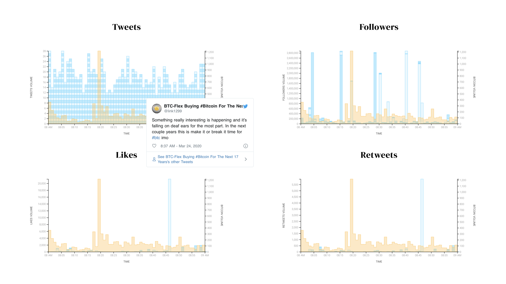
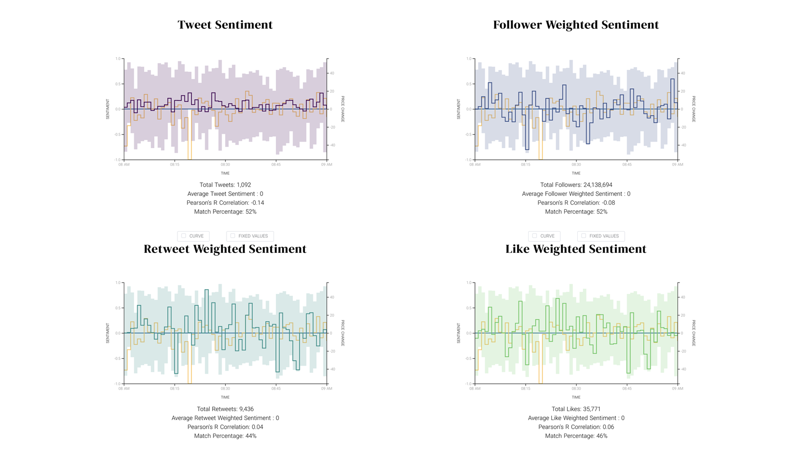
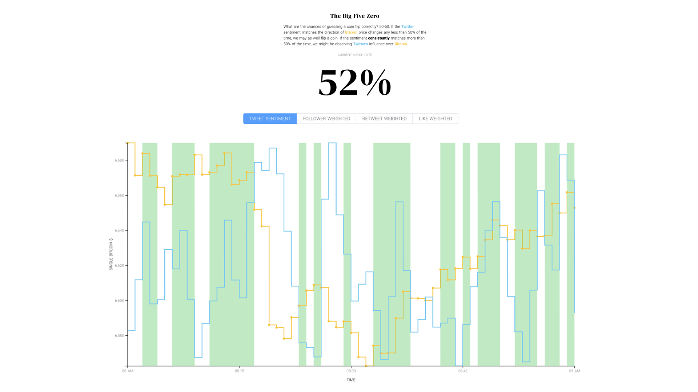

# Is Twitter Feeding Bitcoin?
## An analysis of Twitter content, user behavior, and correlation to Bitcoin market value.
[VIEW PROJECT](http://neiloliver.co/influence)

## Acknowledgements
This project was completed as part of the 2020 Masters in Data Visualization program at Parsons School of Design, NYC. You can view all of the incredible thesis projects [HERE](https://parsons.nyc/thesis-2020/).  

This project would not be possible without the guidance and feedback of the Parsons MSDV faculty, specifically [Daniel Sauter](https://github.com/danielsauter), [Aaron Hill](https://github.com/aaronxhill) & [Karla Polo-Garcia](https://github.com/KayPolo).
The design direction and visual language was developed in conjunction with [Marisa Asari](https://github.com/marisaruizasari). I encourage you to check out her [amazing thesis project](https://weaponsofmassinjustice.netlify.app).

