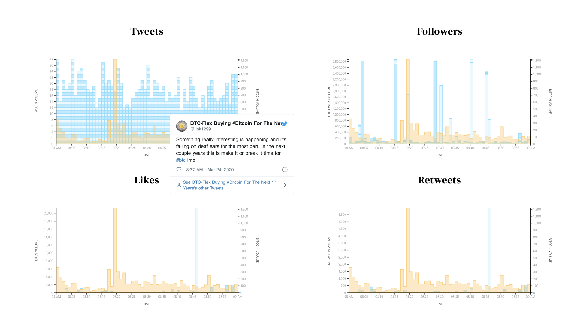
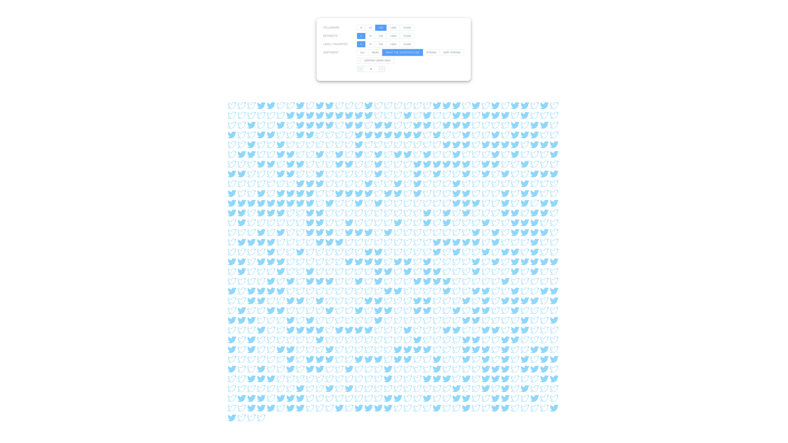
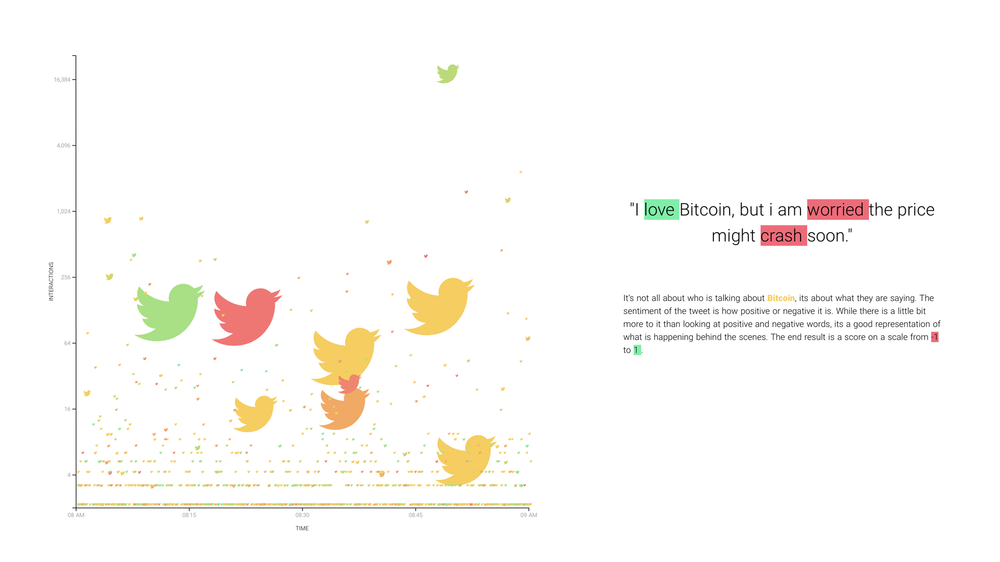
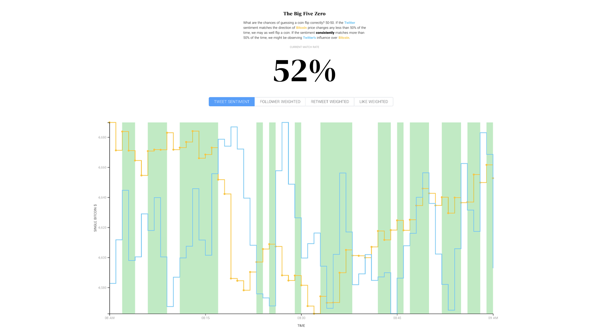
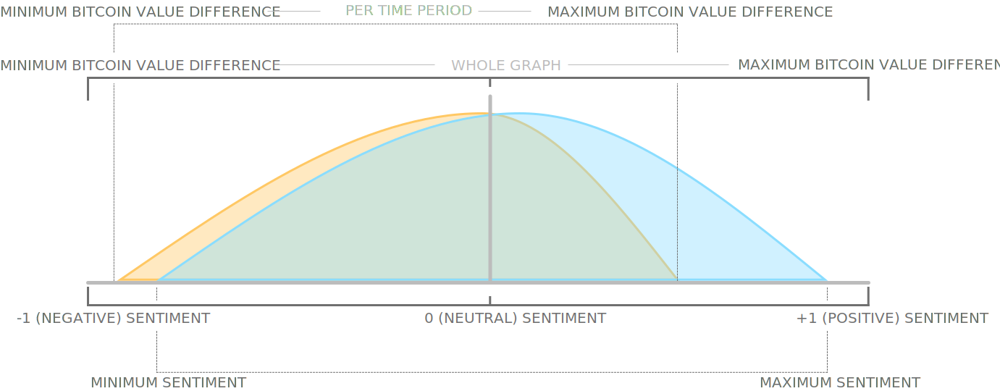

# Is Twitter Feeding Bitcoin? 
[VIEW PROJECT](http://neiloliver.co/influence)
## An analysis of Twitter content, user behavior, and correlation to Bitcoin market value.

### Table of Contents
- [Frameworks & Libraries](#frameworks--libraries)
- [Data Gathering](#data-gathering)
- [Data Retrieval & Aggregation](#data-retrieval--aggregation)
- [Visualization Components](#visualization-components)
- [Additional Custom Components](#additional-custom-components)

## Technical Documentation
*Not what you are looking for? You can find the project homepage [here](../).*

## Frameworks & Libraries
**Application Type:** Server side rendered application  
**Front End Framework:** [NUXT](https://nuxtjs.org) / [Vue.js](https://vuejs.org)  
**UI Component Library:** [Element-UI](https://element.eleme.io/#/en-US)  
**Data Structure:** [MongoDB Atlas](https://www.mongodb.com/cloud/atlas)  
**API:** [Twitter API](https://developer.twitter.com/en/docs) & [Binance API](https://github.com/binance-exchange/binance-api-node)  
**Middleware:** Custom [Node](https://nodejs.org/en/) / [Express](https://expressjs.com) middleware via [NUXT serverMiddleware](https://nuxtjs.org/api/configuration-servermiddleware/)  
**Visualization Library:** [D3.js](https://d3js.org)  
**Additional Libraries:** [ScrollMagic](http://scrollmagic.io), [Lodash](https://lodash.com), [GSAP](https://greensock.com/gsap/), [Axios](https://github.com/axios/axios) & [Twitter-Widget](https://developer.twitter.com/en/docs/twitter-for-websites/javascript-api/overview)  

## Data Gathering
All data gathering was carried out as a batch process using a Node.js script. An additional PM2 instance is used to continuously update the data via socket.IO streams. 
### Twitter Data 
[File](./api/twitter_save.js)  
Twitter data is accessed through three methods.
- Node script via the Twitter premium (paid service) full archive search. This was the intended method for the project was was not used due to limitations in the paid service only allowing access to 50,000 tweets in for the $99 fee.
- Node script using [Twit](https://github.com/ttezel/twit) package to incrementally go back through the previous 7 days (free service) of information.
- Node script using Twit to access Twitter live stream.
#### Sentiment Analysis
Sentiment Analysis was carried out on the tweet body using [Vader](https://github.com/vaderSentiment/vaderSentiment-js) with the compound score used to allow comparisons between tweets.

#### Tweet Data Manipulation
All methods of Twitter data retrieval contain both original Tweets and additional information. The additionl information can includes retweets, comments and user activity. The free twitter serivce also provides sandbox results which do not always match with the search criteria or live twitter content. To ensure data integrity, the following filters and checks were put in place.
- User Follower Count above 0
- Following / Follower ration below 10:1
- Less than 10 hashtags
- Less than 5 @mentions
- Lesson than 5 url links
- Averge daily tweet count below 100 per day
- Filter comment data entry (update original tweet data in database)
- Filter retweet data entry (update original tweet data in database)
- Check creation date in within criteria boundary
- Check keywords set in criteria are in Tweet content
  
For faster retieval by the application and lower storage costs, information that was not required for the application was stripped away leaving only Tweet statistics and ID for use with the Twitter tooltip.
  
### Cryptocurrency Data
[File](./api/candle_save.js)  
Cryptocurrency data was scraped using the [CCTX](https://github.com/ccxt/ccxt) module to incrementally go back through the historical data to a set start date (based on the twitter information being used). Candle data was retrieved in one minute increments. 
#### Candle Data Manipulation
All of the candle data is used within the application so the only manipulation that was required was to convert the data array to an object, convert the date to a javascript date object and calculate the difference between close values. While this does take up additional storage and could be calculated within the application or arregation call to the database, the additional strorage space needed was an acceptable cost to potentially increase application speed.

### Data Storage
All data, once cleaned and restructured is uploaded to a free tier MongoDB database using the [Node MongoDB Client](https://mongodb.github.io/node-mongodb-native/).

## Data Retrieval & Aggregation
Data retrieval from database to the application is carried out via a custom middleware node script using axios within Vue.js.

### Server Middleware
[File](./api/index.js)  
The custom middleware handles two express based endpoints to request data from the MongoDB database. One enpoint handles aggregation requests for both tweets and candles (as they always need to be updated together) and one handles individual tweet data that only needs to be requested on application load and if the start date is changed by the user.

### Aggregation
The main focus of the appliction is to allow the user to set custom filters on the data to see the aggregated results. When the user changes a filter, a lodash debounce function is used to limit multiple simultaneous calls before making an axios request to the aggregation endpoint. Data aggregation is carried out on all of the data (currently over 100,000 tweets) within MongoDB before returning the aggregated results. 
The aggregation must filter against all user settings including time window, time period (one hour or one minute), follower count, like count, comment count, retweet count and verified status. To ensure average values do not mispresent results, the maximum and minimum values for each tweet metric are returned for use in uncertainty visualizations. The aggregation consists of three stages, match, group & project. 
  
## Visualization Components
All visualizations are custom designed and create svg elements through Vue data binding. This allows for reactive elements based on data. Scales and axis are created using the D3.js library. 
### Volume Visualization
[File](./components/volume-vis.vue)  

### Filtering Visulaization
[File](./components/bubble-vis.vue)  


### Sentiment Visualization
[File](./components/sentiment-vis.vue)  

### Correlation Visualization
[File](./components/final-vis.vue)  

  
## Additional Custom Components
### Animate Number
[File](./components/animate-number.vue)  
The animate number component is a component that when passed a value, will animate any changes to the value using the greensock animation platform. The component also allows a custom formatting property and a grow property to draw attention to large value changes.
### Correlation
[File](./components/correlation.vue)  
The correlation component allows inclusion of both a Pearsons R correlation and a Match value to be icluded at serveral points in the application. The match value calculates if the sentiment (either positive or negative) is the same as as the Bitcoin candle difference (either increase or decrease) for each time period. 
### Highlighter
[File](./components/sentiment-highlight.vue)  
The highlighter component allows for a word or phrase to be passed as well as a user defined colour to allow for a looped highlighting animation. The loop is created using CSS and a background offset. 
### Uncertainty
[File](./components/uncertainty-tooltip.vue)  
The uncertainty component makes use of the maximum and minimum values generated during aggregation to show th user the range of potental results and overlap. The mini visualization is used in conjunction with specific details of each data point, on the increase and decrease of Bitcoin value along with the sentiment of the user selected weighted model.


### Twitter Tooltip
[File](./components/twitter-tooltip.vue)  
The Twitter tooltip is a wrapper to pass an ID, create and position a single tweet using the Twitter Widget plugin. 

### Progress Tracker
[File](./components/progress-tracker.vue)  
The progress tracker component creates dot markers on the right hand side of the screen. Each dot is dynamically generated using the ```H1``` tag in the page. Each marker contains the H1 text on hover over and will link to the element anchor on click.
