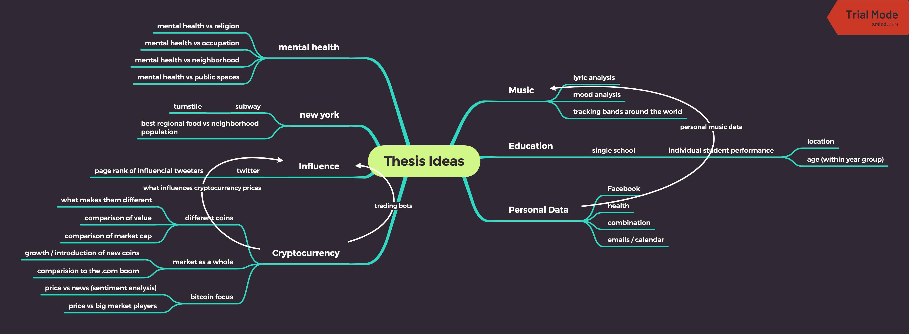
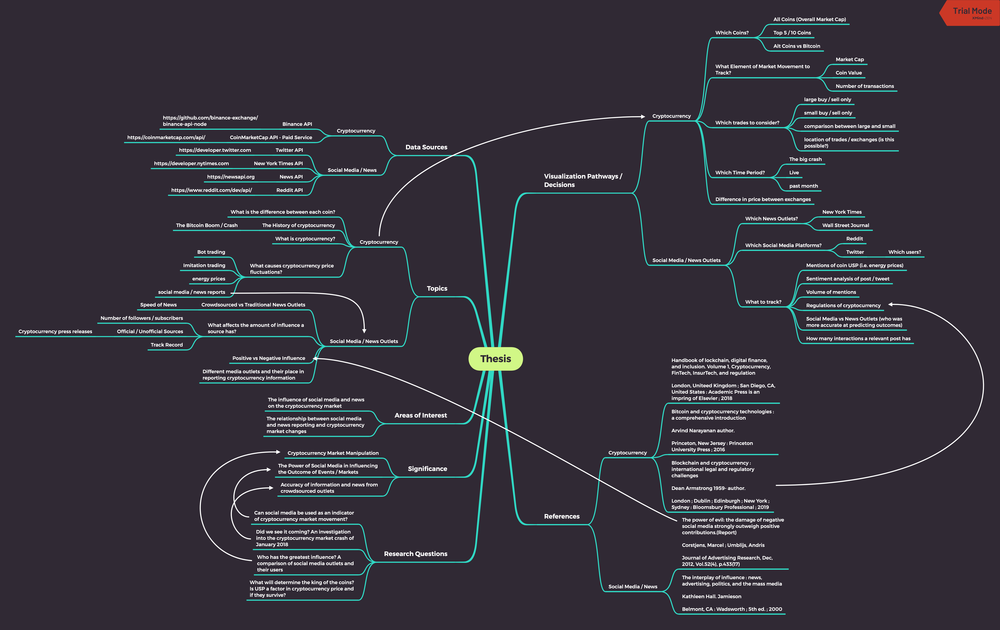
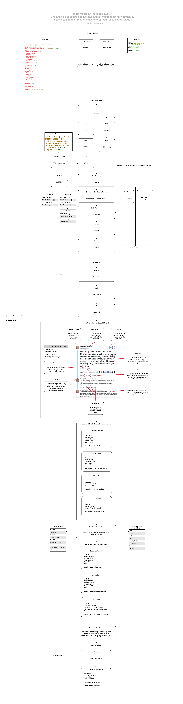
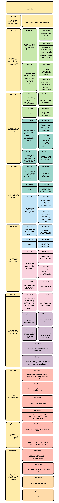

# Major Studio 2 Thesis
  
# Literature Review 
*(updated references below to topic change)*
- Chen, Brian X. *Always on: How the IPhone Unlocked the Anything-Anytime-Anywhere Future--and Locked Us In.* Boston, MA: Da Capo Press, 2012.
- Florini, Ann. *The Right to Know: Transparency for an Open World.* New York: Columbia University Press, 2007.
- Hunter, Richard. *World without Secrets: Business, Crime, and Privacy in the Age of Ubiquitous Computing.* New York: J. Wiley, 2002.
- Fuchs, Christian, Kees Boersma, Anders Albrechtslund, and Marisol Sandoval. *Internet and Surveillance The Challenges of Web 2.0 and Social Media.* Florence: Taylor and Francis, 2013.

# Research Question
## Initial Ideas

## Selected Topic - The relationship between social media / news reporting and cryptocurrency market changes

## Mindmap Structure
  ### Areas of Interest
- The influence of social media and news on the cryptocurrency market
- The relationship between social media and news reporting and cryptocurrency market changes

#### Research Questions
- Can social media be used as an indicator of cryptocurrency market movement?
- Did we see it coming? An investigation into the cryptocurrency market crash of January 2018
- Who has the greatest influence? A comparison of social media outlets and their users
- What will determine the king of the coins? Is USP a factor in cryptocurrency price and if they survive? 

#### Significance
- Cryptocurrency Market Manipulation
- The Power of Social Media in Influencing the Outcome of Events / Markets
- Accuracy of information and news from crowdsourced outlets

  
### Topics 
*(Thesis Structure)*

#### Cryptocurrency
- What is cryptocurrency?  
        - **Reference : Handbook of blockchain, digital finance, and inclusion. Volume 1, Cryptocurrency, FinTech, InsurTech, and regulation**
        - London, Uniteed Kingdom ; San Diego, CA, United States : Academic Press is an impring of Elsevier ; 2018

- What is the difference between each coin?  
    - **Reference : Bitcoin and cryptocurrency technologies : a comprehensive introduction**
    - Arvind Narayanan author.
    - Princeton, New Jersey : Princeton University Press ; 2016

- The History of cryptocurrency
	- The Bitcoin Boom / Crash

- What causes cryptocurrency price fluctuations?
	- Bot trading
	- Imitation trading
	- energy prices
	- social media / news reports
    - Regulation  
        - **Reference : Blockchain and cryptocurrency : international legal and regulatory challenges**
        - Dean Armstrong 1959- author.
        - London ; Dublin ; Edinburgh ; New York ; Sydney : Bloomsbury Professional ; 2019

#### Social Media / News Outlets
- Crowdsourced vs Traditional News Outlets
	- Speed of News

- What affects the amount of influence a source has?
	- Number of followers / subscribers
	- Official / Unofficial Sources
		- Cryptocurrency press releases
	- Track Record  
        - **Reference : The interplay of influence : news, advertising, politics, and the mass media**
        - Kathleen Hall. Jamieson
        - Belmont, CA : Wadsworth ; 5th ed. ; 2000

- Positive vs Negative Influence  
    - **Reference : The power of evil: the damage of negative social media strongly outweigh positive contributions.(Report)**
    - Corstjens, Marcel ; Umblijs, Andris
    - Journal of Advertising Research, Dec, 2012, Vol.52(4), p.433(17)

- Different media outlets and their place in reporting cryptocurrency information

  
### Data Sources
#### Cryptocurrency 
[Binance API](https://github.com/binance-exchange/binance-api-node)

[CoinMarketCap API](https://coinmarketcap.com/api/) - Paid Service

#### Social Media / News
[Twitter API](https://developer.twitter.com)

[New York Times API](https://developer.nytimes.com)

[News API](https://newsapi.org)

[Reddit API](https://www.reddit.com/dev/api/)

  
### Considerations for the Visualization
#### Cryptocurrency
- Which Coins?
	- All Coins (Overall Market Cap)
	- Top 5 / 10 Coins
	- Alt Coins vs Bitcoin

- What Element of Market Movement to Track?
	- Market Cap
	- Coin Value
	- Number of transactions

- Which trades to consider?
	- large buy / sell only
	- small buy / sell only
	- comparison between large and small
	- location of trades / exchanges (is this possible?)

- Which Time Period?
	- The big crash
	- Live
	- past month

- Difference in price between exchanges

#### Social Media / News Outlets
- Which News Outlets?
	- New York Times
	- Wall Street Journal

- Which Social Media Platforms?
	- Reddit
	- Twitter
		- Which users?

- What to track?
	- Mentions of coin USP (i.e. energy prices)
	- Sentiment analysis of post / tweet
	- Volume of mentions
	- Regulations of cryptocurrency
	- Social Media vs News Outlets (who was more accurate at predicting outcomes)
	- How many interactions a relevant post has

# Exercise 2 - Form

### Who is your audience (persona, demographic or processional group, knowledgeable about context)?
Individuals interested in the power of social media as an influencial platorm.  
Indivisuals interested in the correlation between social media usage and cryptocurrency prices. *This is not designed as a financial advisement tool.*  
No prior knowledge of either Twitter or Cryptocurrency is required. Both topics will be given a brief intoduction at the abstract / beginning of the thesis.  
  
### How is your audience reading or encounter your project (media, UI, distribution channel, types of devices, spatial context)?
Project is split into two sections on an interactive website optimized for desktop viewing (functions with limited functionality on mobile).  
First section is an investigation into what elements of social media show to have the largest correction with cryptocurrency market price.  
Second section is an tool combining elements from the first section together with live Twitter and Cryptocurrency data.   
  
### What does your project ask of your audience to do (input, involvement, user experience)?
Select between different options for comparison including time period (1 minite vs 1 hour), crytocurrency (Bitcoin vs Ethereum) and social media variables.
  
### What does your audience learn and take away from their user experience?
How the different elements of social media contribute to determining how much influence a message may (or may not) have.  
An understanding of one of the major elements of price changes in a market not tied to a corporation and "therefore the monetary policy, inflation rates, and economic growth measurements that typically influence the value of currency do not apply" *https://www.investopedia.com/tech/what-determines-value-1-bitcoin/*

## Additional References
[Predicting Cryptocurrency Price Bubbles Using Social Media Data and Epidemic Modelling](https://discovery.ucl.ac.uk/id/eprint/10062913/1/Gorse_Predicting-Cryptocurrency-RP-DG.pdf)  
[Mutual-Excitation of Cryptocurrency Market Returns and Social Media Topics](https://arxiv.org/pdf/1806.11093.pdf)  
[SEISMIC: A Self-Exciting Point Process Model for Predicting Tweet Popularity](https://www.youtube.com/watch?v=N-f9QzY1sxA)  
[Currensee Correlation](https://www1.oanda.com/forex-trading/analysis/currency-correlation)  
    
## Systems Diagram
*Technical Implementation and UI*

# Wireframes
[Wireframe Idea 1](https://xd.adobe.com/view/33591974-7a5f-46a1-7328-ee2f567ae83e-4568/?fullscreen)

[Wireframe Idea 2](https://xd.adobe.com/view/c61019f2-5423-4601-7070-375b96915a18-b021/?fullscreen)

**Wireframe complete flow for idea 1.**

